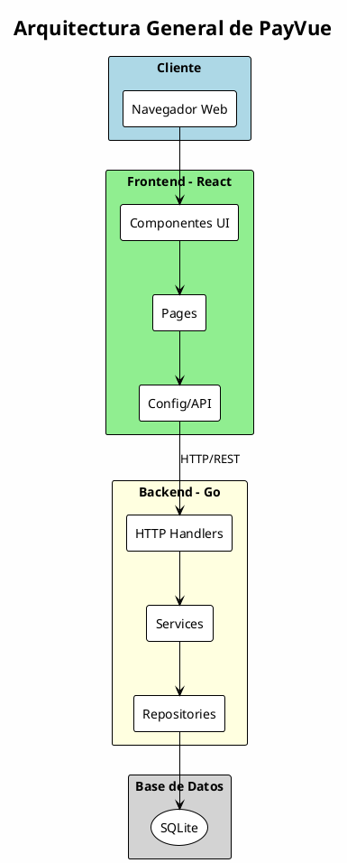
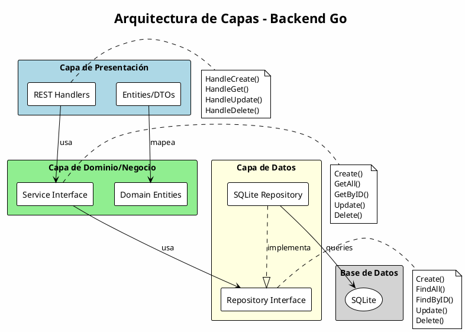
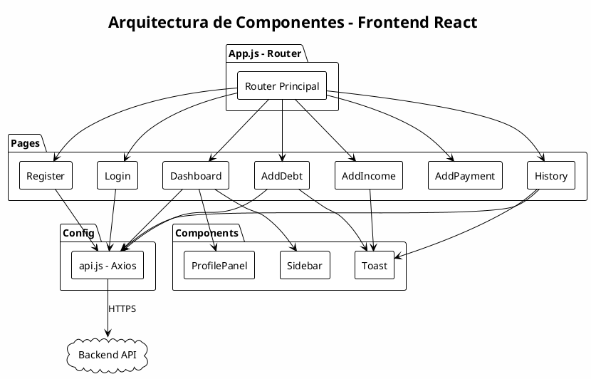
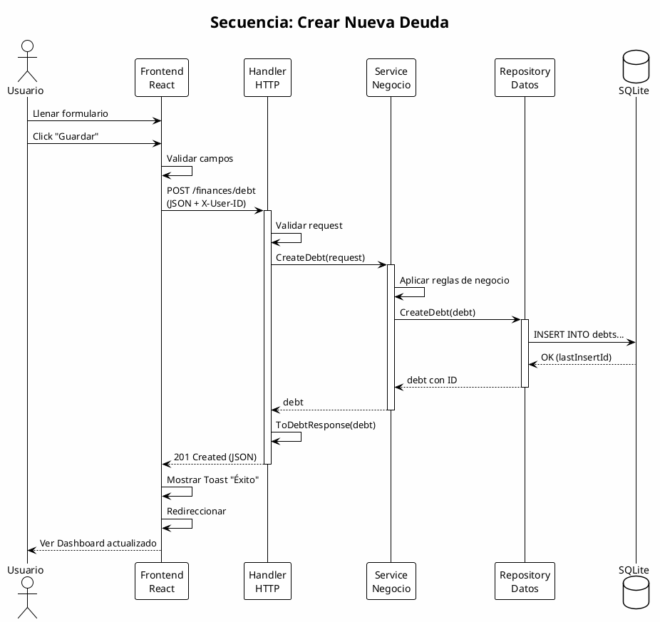
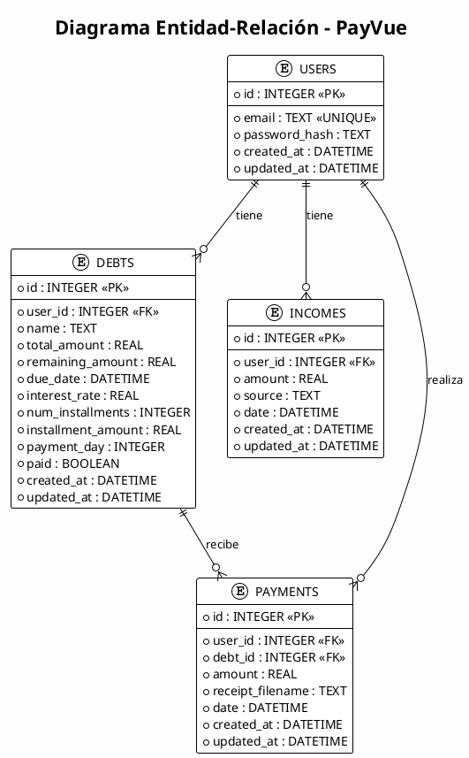
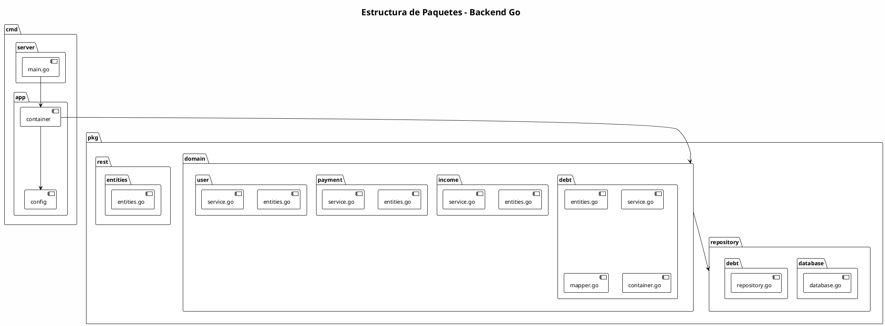

# Arquitectura del Software

## Descripción General

PayVue implementa una **arquitectura de capas** (Layered Architecture) combinada con principios de **Clean Architecture** para el backend, y una arquitectura basada en **componentes** para el frontend.

---

## Diagrama de Arquitectura General



---

## Diagrama de Capas del Backend



---

## Diagrama de Componentes del Frontend



---

## Diagrama de Secuencia - Crear Deuda



---

## Diagrama de Base de Datos (Entidad-Relación)



---

## Diagrama de Paquetes del Backend



---

## Beneficios de la Arquitectura

### Separación de Responsabilidades
- Cada capa tiene una responsabilidad clara
- Facilita el testing unitario
- Permite cambios aislados

### Escalabilidad
- Fácil agregar nuevos endpoints
- Nuevos módulos siguen la misma estructura
- Posibilidad de separar en microservicios

### Mantenibilidad
- Código organizado y predecible
- Fácil localizar y corregir bugs
- Documentación implícita por estructura

### Testabilidad
- Interfaces permiten mocks
- Capas independientes testeables
- Facilita pruebas de integración

---

## Código de Ejemplo por Capa

### 1. Capa de Presentación (Handler)

```go
func makeCreateDebtHandler(debtService debt.Service) http.HandlerFunc {
    return func(w http.ResponseWriter, r *http.Request) {
        userID := getUserIDFromHeader(r)
        
        var request entities.CreateDebtRequest
        if err := json.NewDecoder(r.Body).Decode(&request); err != nil {
            respondWithError(w, http.StatusBadRequest, "error", err.Error())
            return
        }
        
        d, err := debtService.CreateDebt(r.Context(), userID, request.ToDomain())
        if err != nil {
            respondWithError(w, http.StatusInternalServerError, "error", err.Error())
            return
        }
        
        respondWithJSON(w, http.StatusCreated, debt.ToDebtResponse(d))
    }
}
```

### 2. Capa de Dominio (Service)

```go
func (s *service) CreateDebt(ctx context.Context, userID int, req CreateDebtRequest) (*Debt, error) {
    debt := &Debt{
        UserID:            userID,
        Name:              req.Name,
        TotalAmount:       req.TotalAmount,
        RemainingAmount:   req.RemainingAmount,
        InstallmentAmount: req.InstallmentAmount,
        CreatedAt:         time.Now(),
        UpdatedAt:         time.Now(),
    }
    return s.Repository.CreateDebt(ctx, debt)
}
```

### 3. Capa de Datos (Repository)

```go
func (r *repository) CreateDebt(ctx context.Context, d *debt.Debt) (*debt.Debt, error) {
    query := `INSERT INTO debts (...) VALUES (?, ?, ?, ...)`
    result, err := r.db.ExecContext(ctx, query, d.UserID, d.Name, ...)
    if err != nil {
        return nil, err
    }
    id, _ := result.LastInsertId()
    d.ID = int(id)
    return d, nil
}
```

---

## Decisiones de Arquitectura

| Decisión | Justificación |
|----------|---------------|
| Go para Backend | Alto rendimiento, tipado estático, concurrencia |
| SQLite | Simplicidad, sin servidor separado, ideal para MVP |
| React | Ecosistema maduro, componentes reutilizables |
| Clean Architecture | Separación clara, testabilidad, mantenibilidad |
| REST API | Estándar de la industria, stateless |
| Docker | Consistencia entre ambientes, fácil despliegue |
