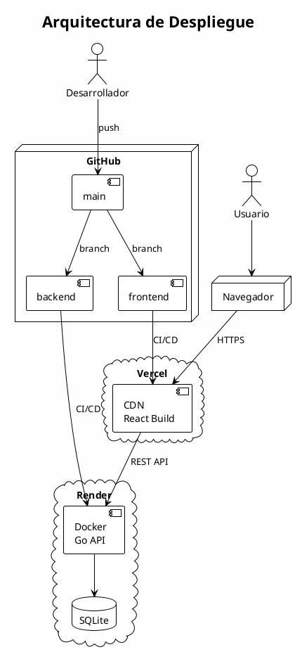
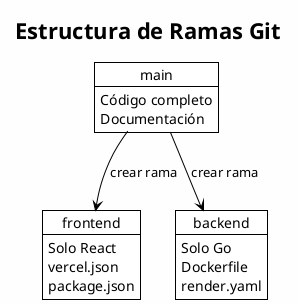
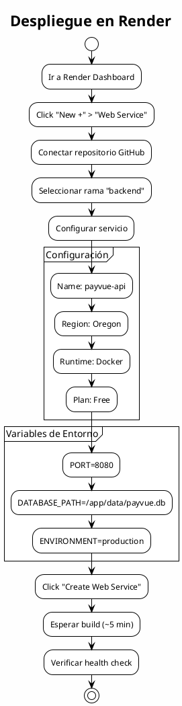
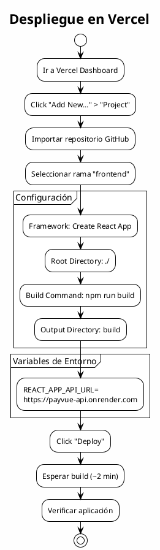
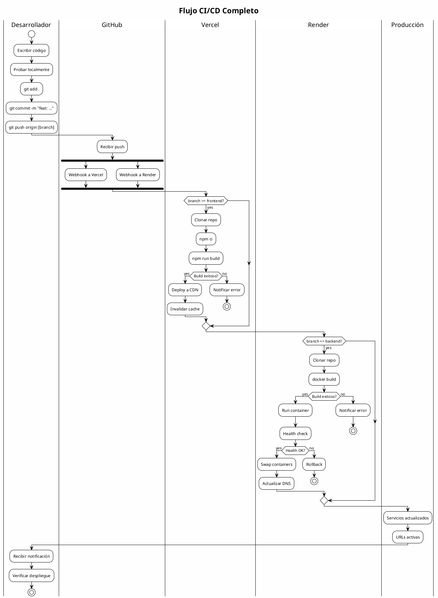

# Proceso de Despliegue

## Descripción General

PayVue utiliza una estrategia de despliegue separada para frontend y backend:

- **Frontend**: Vercel (hosting de aplicaciones React)
- **Backend**: Render (hosting de contenedores Docker)
- **Control de Versiones**: GitHub (ramas separadas)

---

## Arquitectura de Despliegue



---

## Requisitos Previos

### Cuentas Necesarias
- ✅ Cuenta en [GitHub](https://github.com)
- ✅ Cuenta en [Vercel](https://vercel.com)
- ✅ Cuenta en [Render](https://render.com)

### Herramientas Locales
- Git instalado
- Docker y Docker Compose
- Node.js 18+
- Go 1.21+

---

## Paso 1: Preparar el Repositorio

### Estructura de Ramas



### Crear Rama Frontend

```bash
# Desde main
git checkout main
git pull origin main

# Crear rama frontend
git checkout -b frontend

# Copiar archivos del frontend a la raíz
cp -r frontend/* .
rm -rf backend/

# Commit y push
git add .
git commit -m "feat: setup frontend for Vercel"
git push origin frontend
```

### Crear Rama Backend

```bash
# Volver a main
git checkout main

# Crear rama backend
git checkout -b backend

# Copiar archivos del backend a la raíz
cp -r backend/* .
rm -rf frontend/

# Commit y push
git add .
git commit -m "feat: setup backend for Render"
git push origin backend
```

---

## Paso 2: Desplegar Backend en Render

### Diagrama del Proceso



### Configuración del Servicio

| Campo | Valor |
|-------|-------|
| **Name** | payvue-api |
| **Region** | Oregon (US West) |
| **Branch** | backend |
| **Runtime** | Docker |
| **Plan** | Free |

### Variables de Entorno

```
PORT=8080
ENVIRONMENT=production
DATABASE_PATH=/app/data/payvue.db
```

### Archivo render.yaml

```yaml
services:
  - type: web
    name: payvue-api
    runtime: docker
    dockerfilePath: ./Dockerfile
    dockerContext: .
    region: oregon
    plan: free
    healthCheckPath: /health
    envVars:
      - key: PORT
        value: "8080"
      - key: ENVIRONMENT
        value: production
      - key: DATABASE_PATH
        value: /app/data/payvue.db
```

### Verificar Despliegue

```bash
# Health check
curl https://payvue-api.onrender.com/health
# Respuesta: OK - PayVue API Server
```

---

## Paso 3: Desplegar Frontend en Vercel

### Diagrama del Proceso



### Configuración del Proyecto

| Campo | Valor |
|-------|-------|
| **Framework Preset** | Create React App |
| **Root Directory** | ./ |
| **Build Command** | npm run build |
| **Output Directory** | build |

### Variables de Entorno

```
REACT_APP_API_URL=https://payvue-api.onrender.com
```

### Archivo vercel.json

```json
{
  "rewrites": [
    { "source": "/(.*)", "destination": "/index.html" }
  ],
  "headers": [
    {
      "source": "/(.*)",
      "headers": [
        { "key": "X-Content-Type-Options", "value": "nosniff" },
        { "key": "X-Frame-Options", "value": "DENY" }
      ]
    }
  ]
}
```

---

## Flujo Completo de CI/CD



---

## Comandos Útiles

### Desarrollo Local

```bash
# Levantar todo con Docker
docker compose up -d --build

# Ver logs
docker compose logs -f

# Detener
docker compose down
```

### Verificación de Producción

```bash
# Frontend
curl -I https://payvue.vercel.app

# Backend health
curl https://payvue-api.onrender.com/health

# Test login
curl -X POST https://payvue-api.onrender.com/auth/login \
  -H "Content-Type: application/json" \
  -d '{"email":"test@test.com","password":"123456"}'
```

---

## Troubleshooting

### Backend tarda en responder

**Causa**: Render Free Tier pone el servicio en "sleep" después de inactividad.

**Solución**: Primera request tarda ~30s (cold start). El servicio se mantiene activo después.

### Frontend no conecta con backend

**Causa**: Variable de entorno no configurada.

**Solución**:
1. Verificar `REACT_APP_API_URL` en Vercel
2. Hacer redeploy

### Error de CORS

**Causa**: Backend no permite origen del frontend.

**Solución**: Verificar configuración CORS en `main.go`:
```go
router.Use(cors.Handler(cors.Options{
    AllowedOrigins: []string{"*"},
    AllowedMethods: []string{"GET", "POST", "PUT", "DELETE", "OPTIONS"},
}))
```

---

## Checklist de Despliegue

### Backend (Render)
- [ ] Rama `backend` actualizada
- [ ] Dockerfile funcional
- [ ] render.yaml configurado
- [ ] Variables de entorno
- [ ] Health check pasando

### Frontend (Vercel)
- [ ] Rama `frontend` actualizada
- [ ] vercel.json configurado
- [ ] REACT_APP_API_URL configurada
- [ ] Build exitoso

### Integración
- [ ] Login/Register funcional
- [ ] CRUD de datos funcional
- [ ] Separación de datos por usuario

---

## URLs de Producción

| Servicio | URL |
|----------|-----|
| **Frontend** | https://payvue.vercel.app |
| **Backend API** | https://payvue-api.onrender.com |
| **Health Check** | https://payvue-api.onrender.com/health |
| **GitHub** | https://github.com/juanmgg04/payvue_proyecto_software |
