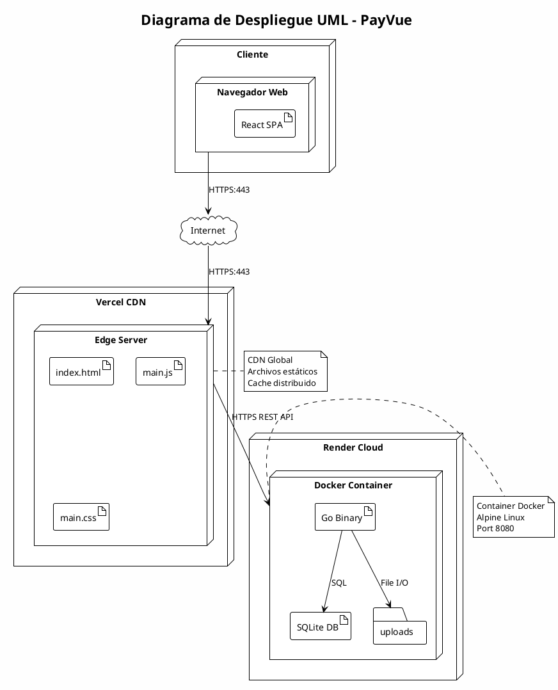
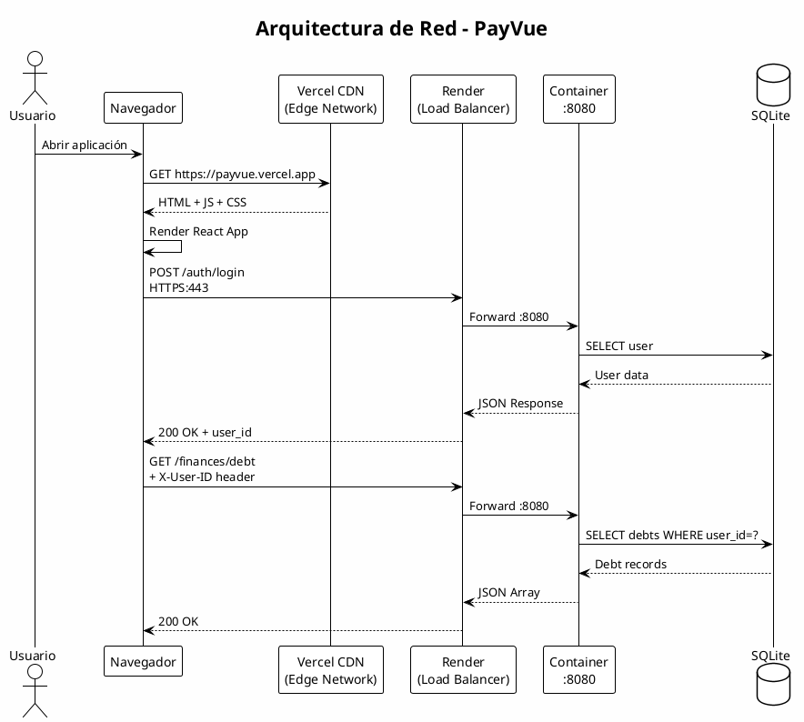
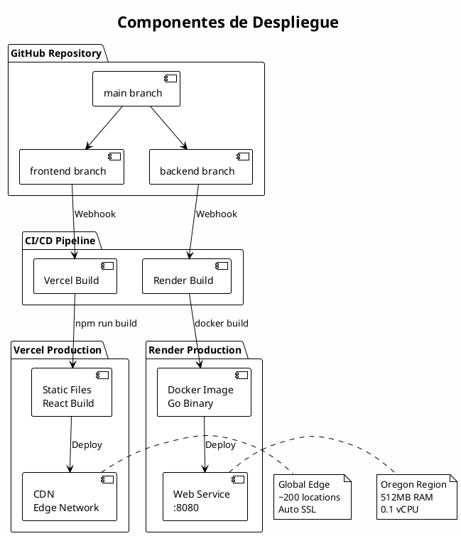
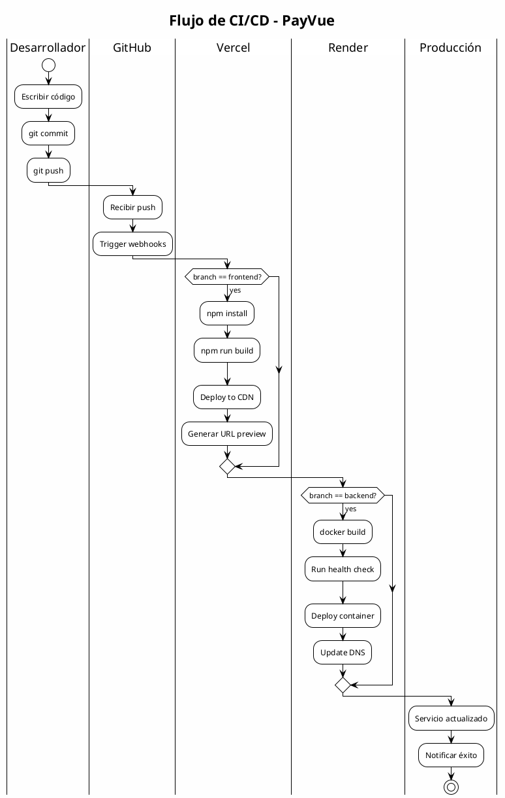
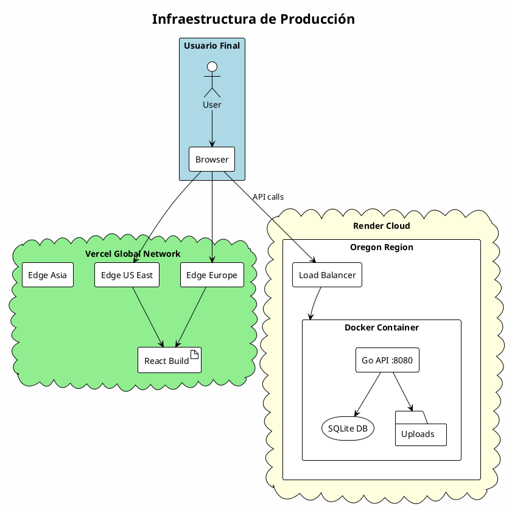
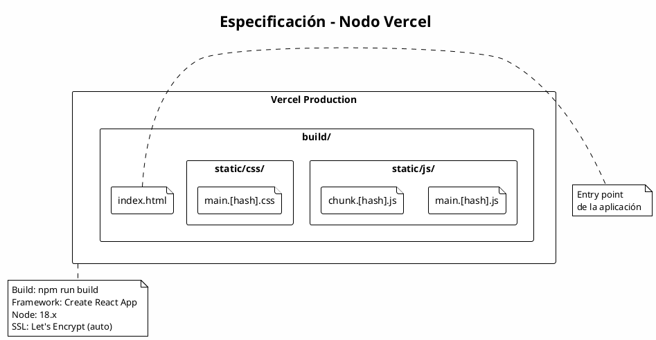
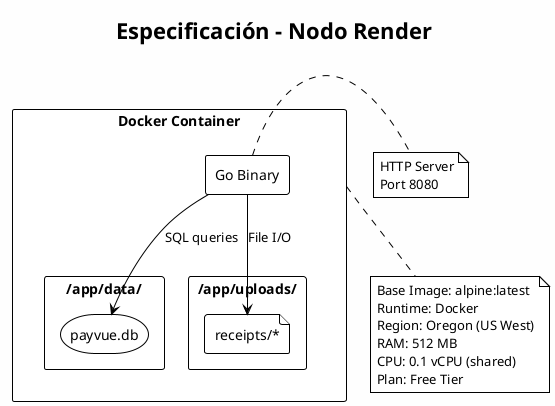
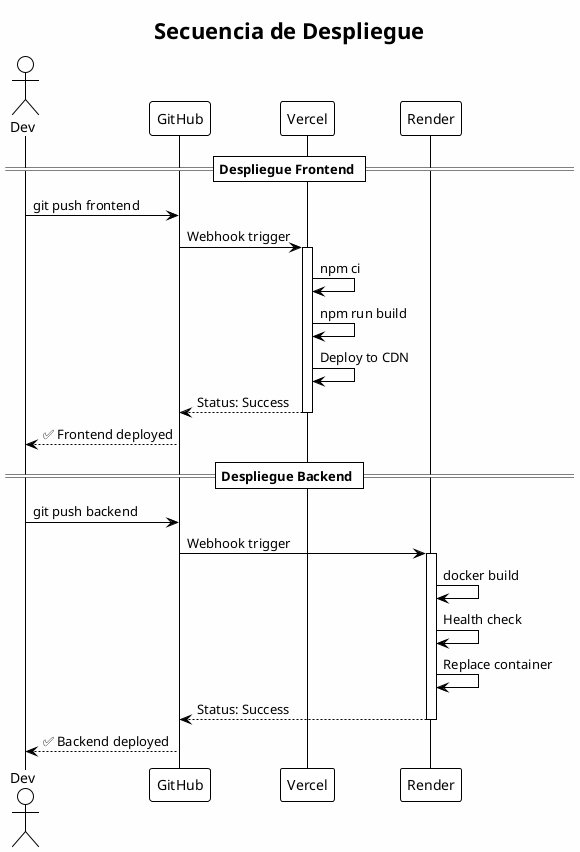
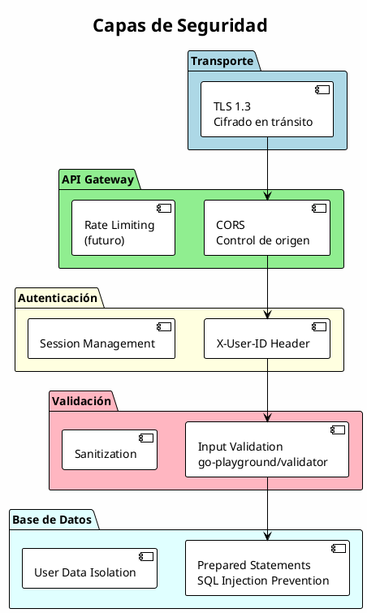

# Diagrama de Despliegue

## Diagrama UML de Despliegue

---

## Diagrama de Arquitectura de Red

---

## Diagrama de Componentes de Despliegue

---

## Diagrama de Flujo de CI/CD

---

## Diagrama de Infraestructura

---

## Especificaciones de Nodos

### Nodo: Vercel (Frontend)

### Nodo: Render (Backend)

---

## Diagrama de Secuencia de Despliegue

---

## Diagrama de Seguridad

---

## URLs de Producción

| Servicio | URL | Descripción |
|----------|-----|-------------|
| Frontend | https://payvue.vercel.app | Aplicación React |
| Backend | https://payvue-api.onrender.com | API REST |
| Health Check | https://payvue-api.onrender.com/health | Estado del servicio |
| GitHub | https://github.com/juanmgg04/payvue_proyecto_software | Código fuente |

---

## Resumen de Especificaciones

| Componente | Tecnología | Especificación |
|------------|------------|----------------|
| **Frontend** | React 18 | Vercel CDN, SSL automático |
| **Backend** | Go 1.21 | Docker Alpine, 512MB RAM |
| **Base de Datos** | SQLite | Embebida en container |
| **CI/CD** | GitHub Webhooks | Despliegue automático |
| **SSL** | Let's Encrypt | Certificados automáticos |
| **CDN** | Vercel Edge | ~200 ubicaciones globales |
