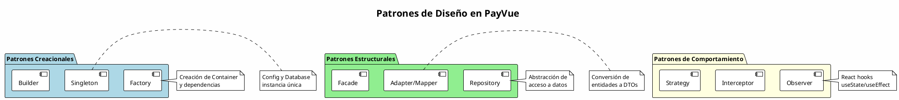
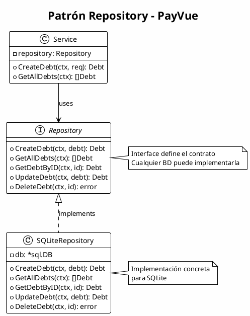
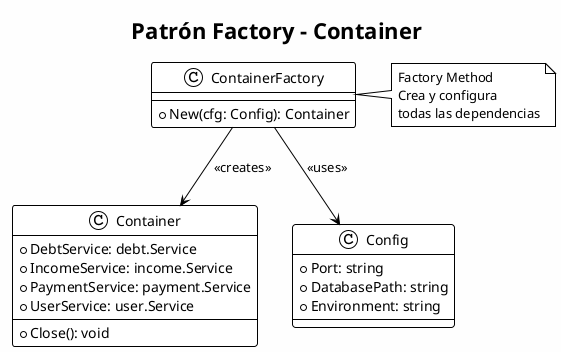
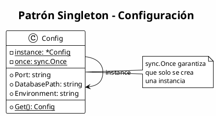
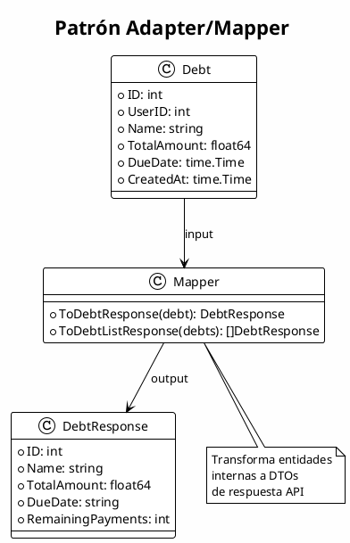
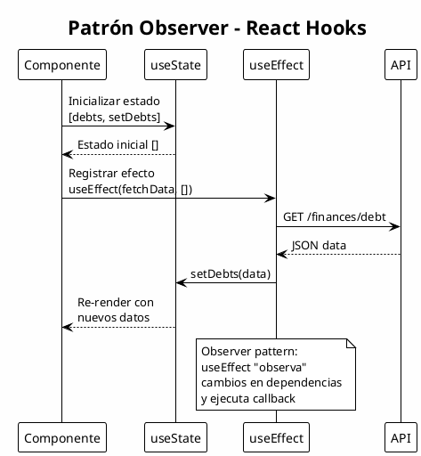
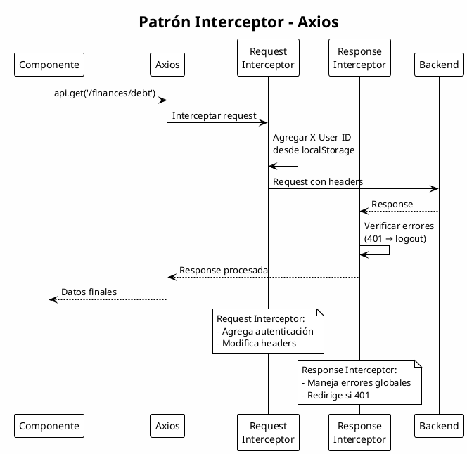
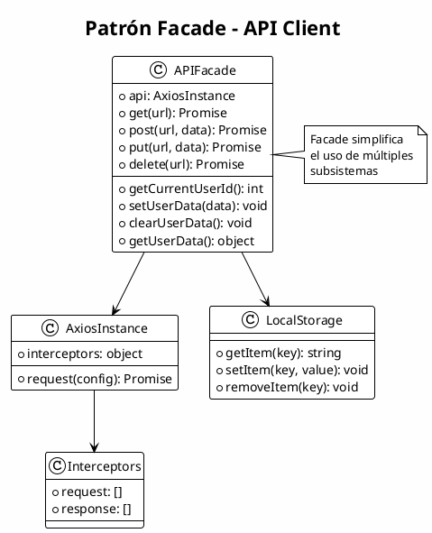
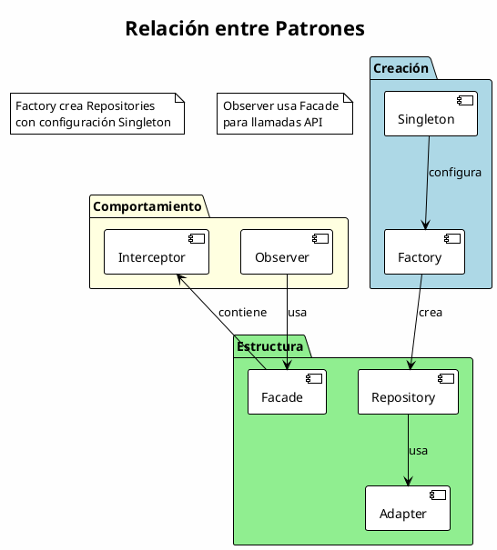

# Patrones de Diseño

## Descripción General

PayVue implementa diversos patrones de diseño tanto en el backend (Go) como en el frontend (React) para garantizar código mantenible, escalable y de alta calidad.

---

## Resumen de Patrones Implementados



---

## 1. Patrón Repository

### Descripción
El patrón Repository actúa como una capa de abstracción entre la lógica de negocio y el acceso a datos.

### Diagrama de Clases



### Implementación en Go

```go
// Interface del Repository
type Repository interface {
    CreateDebt(ctx context.Context, debt *Debt) (*Debt, error)
    GetAllDebts(ctx context.Context) ([]Debt, error)
    GetDebtsByUserID(ctx context.Context, userID int) ([]Debt, error)
    GetDebtByID(ctx context.Context, id int) (*Debt, error)
    UpdateDebt(ctx context.Context, debt *Debt) (*Debt, error)
    DeleteDebt(ctx context.Context, id int) error
}

// Implementación concreta
type repository struct {
    db *sql.DB
}

func NewRepository(db *sql.DB) debt.Repository {
    return &repository{db: db}
}

func (r *repository) CreateDebt(ctx context.Context, d *debt.Debt) (*debt.Debt, error) {
    query := `INSERT INTO debts (...) VALUES (...)`
    result, err := r.db.ExecContext(ctx, query, ...)
    return d, nil
}
```

### Beneficios
- ✅ Desacopla la lógica de negocio del acceso a datos
- ✅ Facilita el testing con mocks
- ✅ Permite cambiar la base de datos sin afectar servicios

---

## 2. Patrón Factory

### Descripción
El patrón Factory se utiliza para crear instancias de objetos complejos, encapsulando la lógica de creación.

### Diagrama



### Implementación

```go
// Factory function - crea y configura todas las dependencias
func New(cfg config.Config) *Container {
    // Inicializar base de datos
    db, err := database.InitDB(cfg.DatabasePath)
    if err != nil {
        log.Fatalf("Failed to initialize database: %v", err)
    }

    // Crear repositorios
    debtRepo := debtRepository.NewRepository(db)
    incomeRepo := incomeRepository.NewRepository(db)
    paymentRepo := paymentRepository.NewRepository(db)
    userRepo := userRepository.NewRepository(db)

    // Crear servicios
    return &Container{
        db:             db,
        DebtService:    debt.New(&debt.Container{Repository: debtRepo}),
        IncomeService:  income.New(&income.Container{Repository: incomeRepo}),
        PaymentService: payment.New(&payment.Container{Repository: paymentRepo}),
        UserService:    user.New(&user.Container{Repository: userRepo}),
    }
}
```

---

## 3. Patrón Singleton

### Descripción
Garantiza que una clase tenga solo una instancia y proporciona un punto de acceso global.

### Diagrama



### Implementación

```go
var configInstance *Config
var once sync.Once

func Get() Config {
    once.Do(func() {
        configInstance = &Config{
            Port:         getEnv("PORT", "8080"),
            DatabasePath: getEnv("DATABASE_PATH", "./data/payvue.db"),
            Environment:  getEnv("ENVIRONMENT", "development"),
        }
    })
    return *configInstance
}
```

---

## 4. Patrón Adapter/Mapper

### Descripción
Convierte la interfaz de una clase en otra que el cliente espera. Se usa para transformar entidades de dominio a DTOs.

### Diagrama



### Implementación

```go
func ToDebtResponse(d *Debt) DebtResponse {
    remainingPayments := 0
    if d.InstallmentAmount > 0 {
        remainingPayments = int(math.Ceil(d.RemainingAmount / d.InstallmentAmount))
    }

    return DebtResponse{
        ID:                d.ID,
        Name:              d.Name,
        TotalAmount:       d.TotalAmount,
        RemainingAmount:   d.RemainingAmount,
        DueDate:           d.DueDate.Format("2006-01-02"),
        RemainingPayments: remainingPayments,
        Paid:              d.Paid,
    }
}
```

---

## 5. Patrón Observer (Frontend)

### Descripción
En React, el patrón Observer se implementa mediante hooks que "observan" cambios en el estado.

### Diagrama



### Implementación

```jsx
function Dashboard() {
  // Estado observable
  const [debts, setDebts] = useState([]);

  // Observer - se ejecuta cuando cambian dependencias
  const fetchData = useCallback(async () => {
    try {
      const response = await api.get('/finances/debt');
      setDebts(response.data || []);
    } catch (error) {
      console.error('Error:', error);
    }
  }, []);

  // Suscripción a cambios
  useEffect(() => {
    fetchData();
    const interval = setInterval(fetchData, 5000);
    return () => clearInterval(interval);
  }, [fetchData]);

  return (
    <div>
      {debts.map(debt => <DebtCard key={debt.id} debt={debt} />)}
    </div>
  );
}
```

---

## 6. Patrón Interceptor (Frontend)

### Descripción
Los interceptores de Axios modifican requests/responses de forma centralizada.

### Diagrama



### Implementación

```javascript
const api = axios.create({
  baseURL: API_URL,
  headers: { 'Content-Type': 'application/json' }
});

// Request Interceptor
api.interceptors.request.use(
  (config) => {
    const user = JSON.parse(localStorage.getItem('user') || '{}');
    if (user.user_id) {
      config.headers['X-User-ID'] = user.user_id;
    }
    return config;
  },
  (error) => Promise.reject(error)
);

// Response Interceptor
api.interceptors.response.use(
  (response) => response,
  (error) => {
    if (error.response?.status === 401) {
      localStorage.removeItem('user');
      window.location.href = '/';
    }
    return Promise.reject(error);
  }
);
```

---

## 7. Patrón Facade

### Descripción
Proporciona una interfaz simplificada a un conjunto de interfaces en un subsistema.

### Diagrama



---

## Diagrama de Relación de Patrones



---

## Resumen de Patrones

| Patrón | Ubicación | Propósito |
|--------|-----------|-----------|
| **Repository** | `pkg/repository/` | Abstracción de acceso a datos |
| **Factory** | `cmd/app/container/` | Creación de dependencias |
| **Singleton** | `config/`, `database/` | Instancia única de config y DB |
| **Adapter/Mapper** | `pkg/domain/*/mapper.go` | Transformación de entidades |
| **Observer** | React Hooks | Reactividad de UI |
| **Interceptor** | `api.js` | Modificación de requests |
| **Facade** | `api.js` | Interfaz simplificada |

---

## Conclusión

La combinación de estos patrones proporciona:

1. **Código mantenible** - Cada patrón tiene una responsabilidad clara
2. **Testabilidad** - Las interfaces permiten mocks
3. **Escalabilidad** - Fácil agregar nuevas funcionalidades
4. **Reutilización** - Componentes y lógica reutilizable
5. **Desacoplamiento** - Capas independientes entre sí
