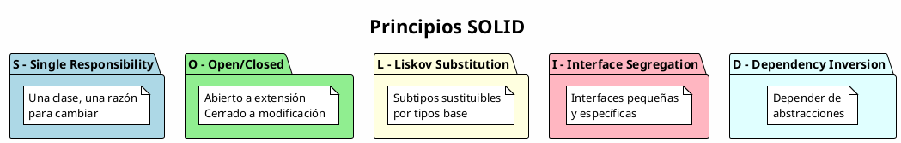
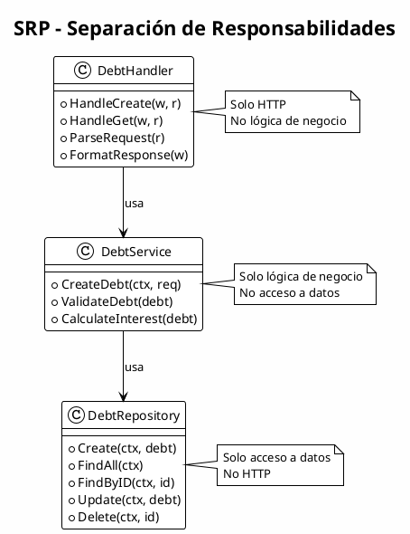
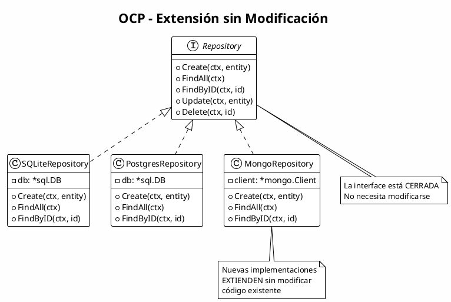
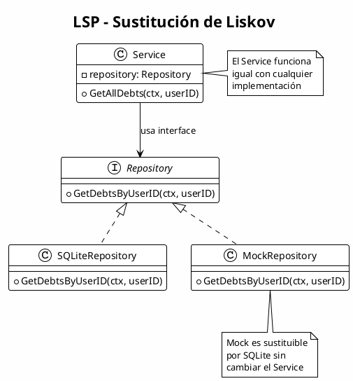
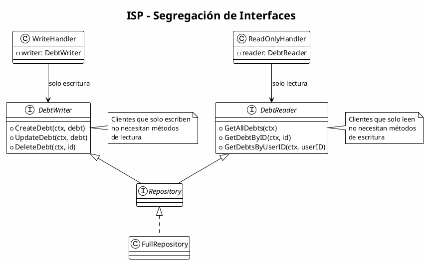
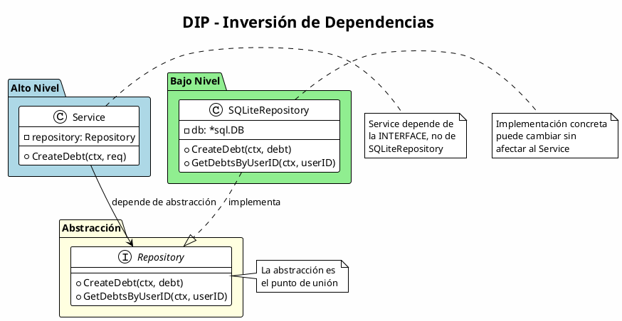
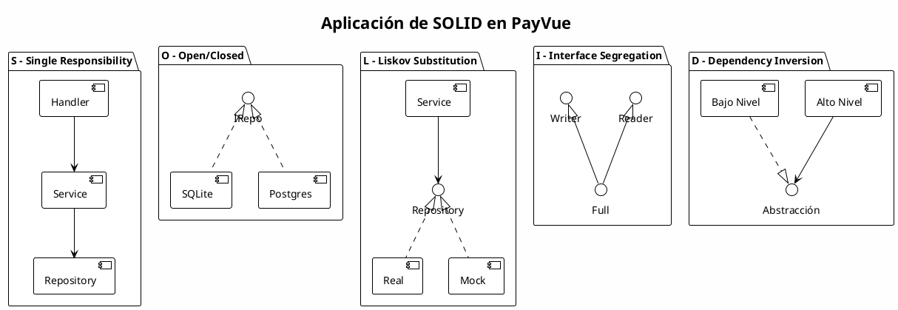

# Principios SOLID

## Descripción General

Los principios SOLID son cinco principios de diseño orientado a objetos que hacen el software más comprensible, flexible y mantenible.

---

## Los 5 Principios SOLID



---

## S - Single Responsibility Principle (SRP)

### Principio
> "Una clase debe tener una, y solo una, razón para cambiar."

### Diagrama



### Implementación - Separación de Responsabilidades

```go
// Handler - SOLO manejo HTTP
func makeCreateDebtHandler(service debt.Service) http.HandlerFunc {
    return func(w http.ResponseWriter, r *http.Request) {
        var request entities.CreateDebtRequest
        json.NewDecoder(r.Body).Decode(&request)
        debt, _ := service.CreateDebt(r.Context(), request.ToDomain())
        respondWithJSON(w, http.StatusCreated, debt)
    }
}

// Service - SOLO lógica de negocio
func (s *service) CreateDebt(ctx context.Context, req CreateDebtRequest) (*Debt, error) {
    if req.TotalAmount <= 0 {
        return nil, ErrInvalidAmount
    }
    debt := &Debt{Name: req.Name, TotalAmount: req.TotalAmount}
    return s.Repository.CreateDebt(ctx, debt)
}

// Repository - SOLO acceso a datos
func (r *repository) CreateDebt(ctx context.Context, d *debt.Debt) (*debt.Debt, error) {
    query := `INSERT INTO debts (...) VALUES (...)`
    result, _ := r.db.ExecContext(ctx, query, ...)
    return d, nil
}
```

---

## O - Open/Closed Principle (OCP)

### Principio
> "Las entidades deben estar abiertas para extensión, pero cerradas para modificación."

### Diagrama



### Implementación

```go
// Interface (cerrada a modificación)
type Repository interface {
    CreateDebt(ctx context.Context, debt *Debt) (*Debt, error)
    GetAllDebts(ctx context.Context) ([]Debt, error)
}

// Implementación SQLite existente
type sqliteRepository struct {
    db *sql.DB
}

// Nueva implementación PostgreSQL (extensión)
type postgresRepository struct {
    db *sql.DB
}

func (r *postgresRepository) CreateDebt(ctx context.Context, d *debt.Debt) (*debt.Debt, error) {
    // Implementación específica para PostgreSQL
    query := `INSERT INTO debts (...) VALUES (...) RETURNING id`
    return d, nil
}
```

---

## L - Liskov Substitution Principle (LSP)

### Principio
> "Los objetos deben ser reemplazables por instancias de sus subtipos sin alterar el funcionamiento."

### Diagrama



### Implementación

```go
// El Service puede usar cualquier implementación de Repository
type service struct {
    Repository Repository // Interface
}

func (s *service) GetAllDebts(ctx context.Context, userID int) ([]Debt, error) {
    // Este código funciona con SQLiteRepo, PostgresRepo, MockRepo, etc.
    return s.Repository.GetDebtsByUserID(ctx, userID)
}

// MockRepository cumple el mismo contrato
type MockRepository struct {
    debts []debt.Debt
}

func (m *MockRepository) GetDebtsByUserID(ctx context.Context, userID int) ([]debt.Debt, error) {
    var result []debt.Debt
    for _, d := range m.debts {
        if d.UserID == userID {
            result = append(result, d)
        }
    }
    return result, nil
}

// En tests - sustitución sin problemas
func TestGetAllDebts(t *testing.T) {
    mockRepo := &MockRepository{debts: testDebts}
    service := debt.NewService(&debt.Container{Repository: mockRepo})
    debts, err := service.GetAllDebts(context.Background(), 1)
    // Funciona exactamente igual
}
```

---

## I - Interface Segregation Principle (ISP)

### Principio
> "Muchas interfaces específicas son mejores que una interfaz de propósito general."

### Diagrama



### Implementación

```go
// Interfaces segregadas por funcionalidad

// Interface solo para lectura
type DebtReader interface {
    GetAllDebts(ctx context.Context) ([]Debt, error)
    GetDebtsByUserID(ctx context.Context, userID int) ([]Debt, error)
    GetDebtByID(ctx context.Context, id int) (*Debt, error)
}

// Interface solo para escritura
type DebtWriter interface {
    CreateDebt(ctx context.Context, debt *Debt) (*Debt, error)
    UpdateDebt(ctx context.Context, debt *Debt) (*Debt, error)
    DeleteDebt(ctx context.Context, id int) error
}

// Interface completa (composición)
type Repository interface {
    DebtReader
    DebtWriter
}

// Handler que solo necesita lectura
type readOnlyHandler struct {
    reader DebtReader // No expone métodos de escritura
}

// Handler que solo necesita escritura
type writeHandler struct {
    writer DebtWriter // No expone métodos de lectura
}
```

---

## D - Dependency Inversion Principle (DIP)

### Principio
> "Depende de abstracciones, no de implementaciones concretas."

### Diagrama



### Implementación

```go
// El Service depende de la abstracción (interface)
type service struct {
    Repository Repository // Interface, NO *sqliteRepository
}

func New(container *Container) Service {
    return &service{
        Repository: container.Repository, // Se inyecta la dependencia
    }
}

func (s *service) CreateDebt(ctx context.Context, req CreateDebtRequest) (*Debt, error) {
    // El service no sabe qué implementación de Repository usa
    debt := &Debt{...}
    return s.Repository.CreateDebt(ctx, debt) // Usa la abstracción
}

// Inyección de Dependencias en Container
func New(cfg config.Config) *Container {
    db, _ := database.InitDB(cfg.DatabasePath)
    
    // Crear implementación concreta
    debtRepo := debtRepository.NewRepository(db) // Retorna interface
    
    // Inyectar dependencia abstracta
    debtContainer := &debt.Container{
        Repository: debtRepo, // Interface, no implementación
    }
    
    return &Container{
        DebtService: debt.New(debtContainer),
    }
}
```

---

## Diagrama de Aplicación Completa de SOLID



---

## Resumen de Principios SOLID en PayVue

| Principio | Implementación | Beneficio |
|-----------|---------------|-----------|
| **S**ingle Responsibility | Handler, Service, Repository separados | Código fácil de mantener |
| **O**pen/Closed | Interfaces para extensión | Agregar features sin modificar |
| **L**iskov Substitution | Repositories intercambiables | Testing con mocks |
| **I**nterface Segregation | Interfaces pequeñas (Reader, Writer) | Componentes desacoplados |
| **D**ependency Inversion | Inyección de dependencias | Flexibilidad y testing |

---

## Conclusión

La aplicación consistente de SOLID en PayVue resulta en:

1. **Código mantenible** - Cambios localizados y predecibles
2. **Alta cohesión** - Componentes enfocados en una tarea
3. **Bajo acoplamiento** - Dependencias mediante abstracciones
4. **Facilidad de testing** - Mocks e inyección de dependencias
5. **Extensibilidad** - Nuevas features sin romper existentes
